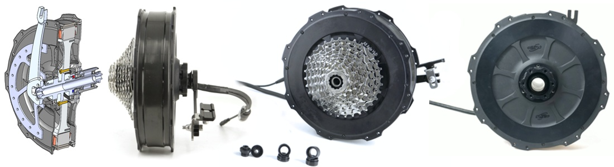
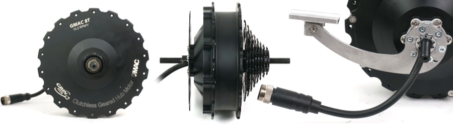
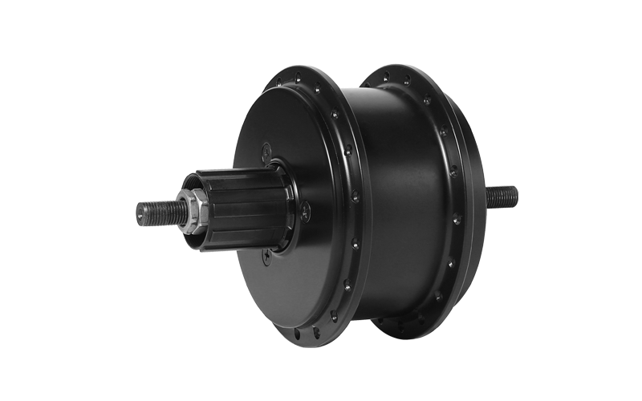
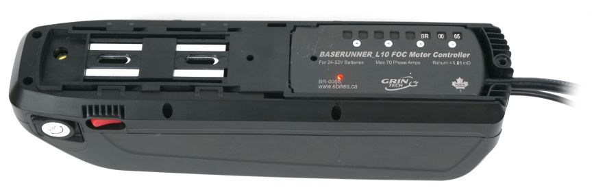
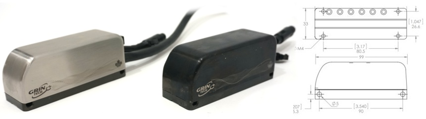
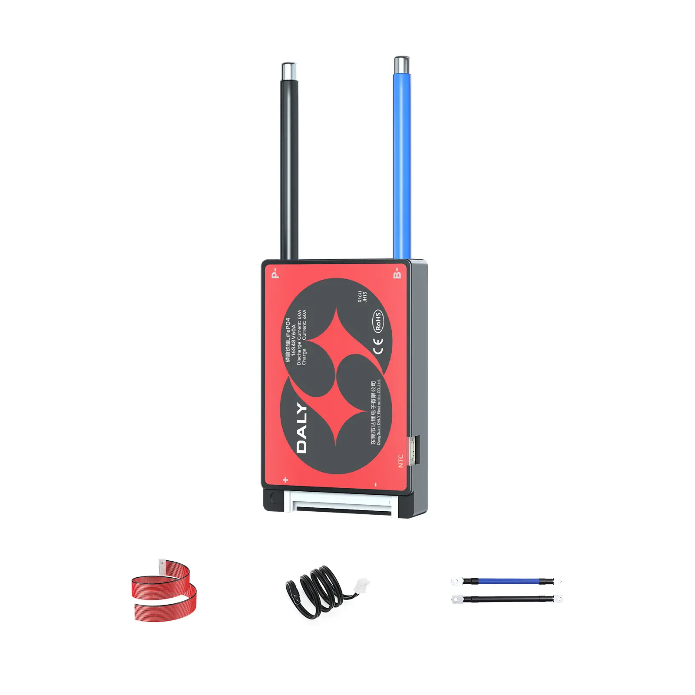
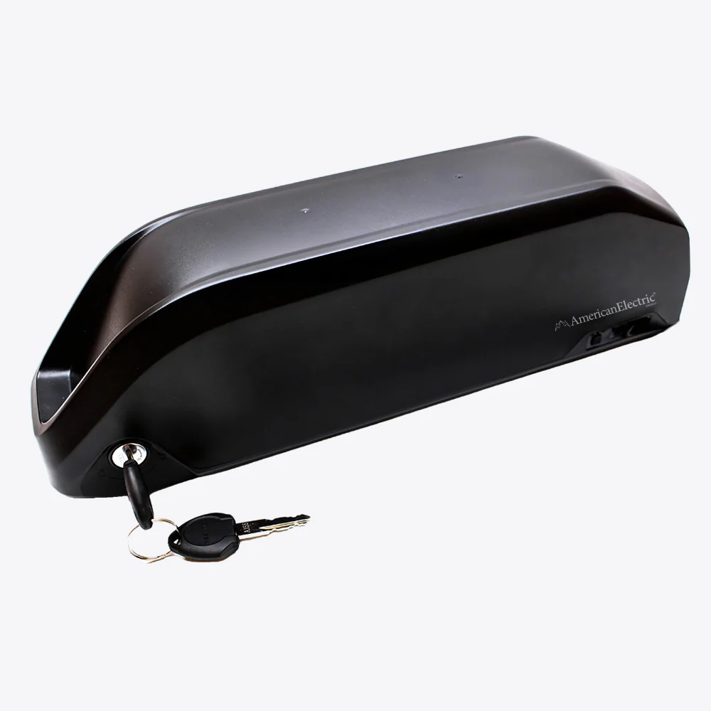
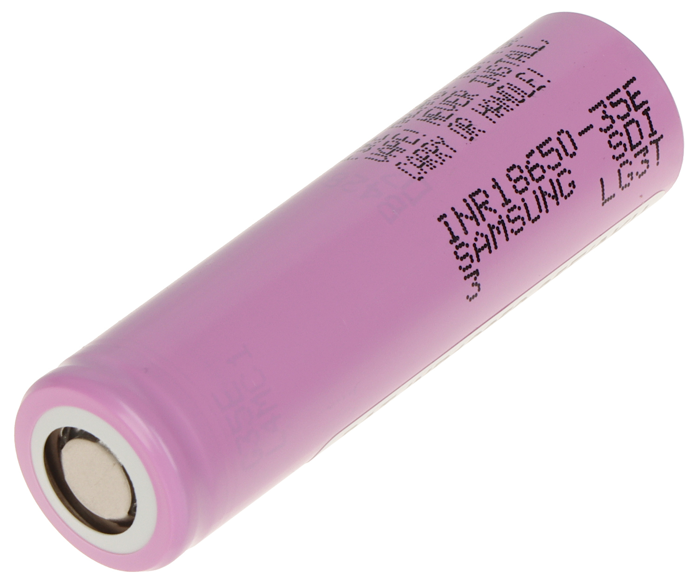

[Page d'accueil](./index.md)/[02. Composants](./02_components_fr.md)

# Motorisations
## Moteurs
### Grin All-Axle Rear V3 Hub slow HG
Moteur moyeu pour roue arrière direct drive avec capteur de couple intégré

 - 142/148mm Thru-Axle
 - 135 Quick-release
 - Shimano HG (10s) or SRAM XD
 - 4.25kg
 - avec batterie 36V:
   - couple max sur la roue 75.7Nm
   - puissance batterie max 1255W/35A/36V
 - [Page officielle](https://ebikes.ca/product-info/grin-products/all-axle-hub-motor.html) USD$ 785.- avec adapter, statorade, et 250W laser mark

### Grin GMAC
Moteur moyeu pour roue arrière avec engrenage planétaire bloqué pour permettre la regen. Capteur de vitesse intégré mais pas de couple.

 - Seulement pour cadre avec 10 mm pour l'axe (Quick-release)
 - O.L.D. 138 mm (135 mm et 142 mm ok)
 - [Page officielle](https://ebikes.ca/product-info/grin-kits/gmac.html) 

### Tongsheng AKM100SX
Moteur moyeu pour roue arrière en direct drive

 - Max torque 50 Nm
 - Super léger 2.2 kg
 - [Page officielle](https://www.tongsheng-e.com/product/50.html)

## Controleurs
### Grin Baserunner L10 Controller
Controleur de moteur indépendant passant dans le support de batterie

 - Compatible avec batterie 24V-52V (max 60V)
 - 80 A en pic, 45-50A continu
 - Passe dans support de batterie Hailong (out of stock) et Reention
 - [Page officielle](https://ebikes.ca/shop/electric-bicycle-parts/controllers/baserunner-l10-motor-controller.html) USD$ 270.- avec baseplate

### Grin Phaserunner
Controleur de moteur à installer sur un tube du cadre.

 - Compatible avec batterie 24V-72V (max 90V)
 - 90A en pic, 45-50A en continu
 - [Page Officielle](https://ebikes.ca/product-info/grin-products/phaserunner.html) USD$ 350.-

## Batteries
### Daly BMS ModelH
BMS pour batterie custom

 - 40A/60A max discharge/charge
 - 10/13/14s
 - 75 mm x 48 mm x 14 mm
 - [Page "officielle"](https://www.dalybms.com/18650-bms-h-series-standard-bms-3s-to-16s-40a-60a-product/)

### Reention Polly DP-6C
Boîtier pour batterie custom

 - 65 cellules 18650
 - 10s6p (~36V 20.4Ah) ou 13s5p (48V(46.8V) 17Ah)
 - Alternative:
   - Polly DP-9C (84 cellules 10s8p, 13s6p, 14s6p)
   - Polly DP-5C (52 cellules 10s5p, 13s4p)
 - Baserunner fit
 - Revendeur:
   - [topbikekit](https://topbikekit.com/pollydp6c-battery-case-65pcs-18650-cells-with-inner-9-tube-controller-p-765.html) USD$ 26.-

### Samsung INR18650-35E
Cellule

 - Rated capacity 3500 mAh (min 3350 mAh)
 - Measured capacity :
   - 3400 mAh @ 0.2 A
   - 3380 mAh @ 0.5 A
   - 3360 mAh @ 1.0 A
   - 3330 mAh @ 2.0 A
   - 3300 mAh @ 3.0 A
   - 3260 mAh @ 5.0 A
 - Max continuous discharge current 8.0 A
 - Max charging current 2.0 A
 - Weight 48 g
 - Revendeur :
   - [nkon.nl](https://www.nkon.nl/en/samsung-inr18650-35e.html) €2.34 (€2.09 pour 100, €1.99 pour 200, €1.84 pour 600)

### LG INR18650MJ1
Cellule

 - Rated capacity 3500 mAh (min 3400 mAh)
 - Measured capacity :
   - 3380 mAh @ 0.68 A
   - 3275 mAh @ 2.0 A
   - 3260 mAh @ 5.0 A
   - 3210 mAh @ 8.0 A
   - 3205 mAh @ 10.0 A
 - Max discharge current 10.0 A
 - Max charging current 1.0 C (3.4 A)
 - Weight 50 g
 - Revendeur :
   - [nkon.nl](https://www.nkon.nl/novat/inr18650-mj1.html) €2.55 (€2.10 pour 10, €1.37 pour 11)

### Grin Technology : FreeGen Motor
Le coeur des eBikes Concretely Screwed est son moteur à récupération d'énergie FreeGen. Grin Technology est une petite entreprise basée à Vancouver fabriquant des moteurs et des contrôleurs pour vélo de grande qualité. Il s'agit d'un bureau d'ingénieurs passionnés par le vélo proposant des solutions idéales pour des projets complétement sur mesure.
