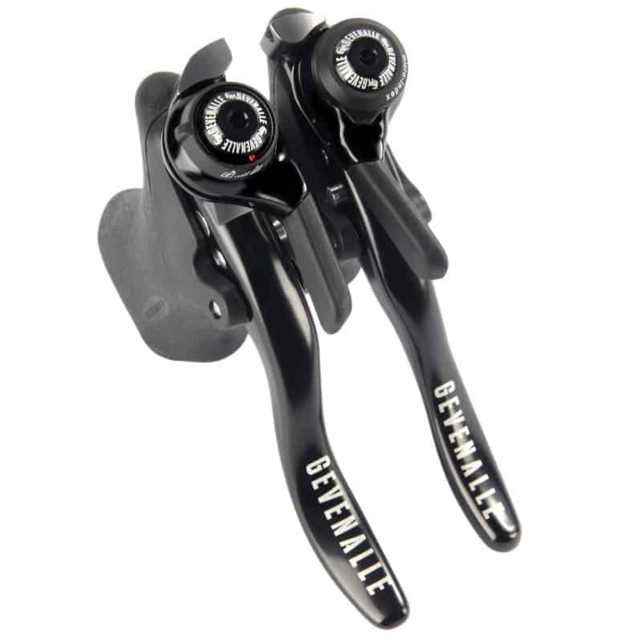
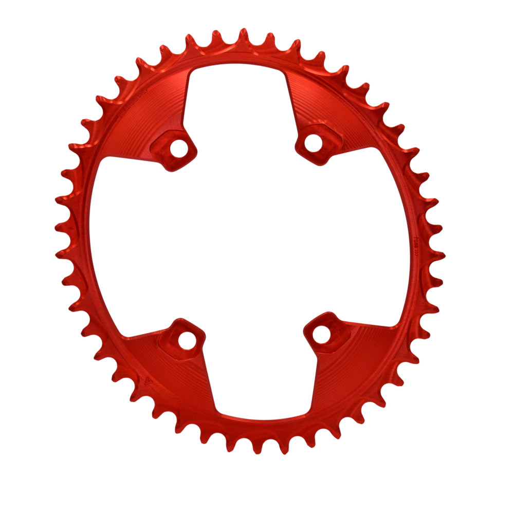

[Page d'accueil](./index.md)/[02. Composants](./02_components_fr.md)

# Transmissions
## Boite à vitesse
- Permet de mettre une courroie (si cadre compatible)
- Virtuellement immortel
- Réglage spécifique
- Peu de système de shifter disponible, par défaut un twist shifter

### Pinion P1.18
Avec ces 18 rapports espacé linéairement sur 636%, la boite à vitesse P1.18 de Pinion est simplement ce qui se fait de mieux. Que ce soit dans les montées ou dans les descentes, la plage de rapport disponible sera parfaite en toute circomstance. Couplée à une transmission à courroie, il s'agit de la solution demandant le moins d'entretien. Fini la graisse sur les pantalons, les courroies se nettoient à l'eau et dûre environ 10'000 km, et certainement plus avec un moteur dans la roue arrière qui va réduire la force passant par la transmission.

- 18 rapports régulié
- 636%
- Requiert un cadre avec sabot spécial pour Pinion
- Permet de combiner avec moteur moyeu (à vérifier le comfort d'utilisation)
- 2'698 g (3946 g avec couroie, moyeu et pinions) [source](https://www.bicycle-junkies.com/review-pinion-p1-18-gearbox-with-gates-cdx-belt/)
- [Page officielle](https://pinion.eu/en/p-line/) 1449.00 Euro

### Rolhoff Speedhub
Boite à vitesse intégrée au moyeu 14 rapports 

- 14 rapports régulié
- 526%
- Peut être installer sur un cadre normal
- Ne peu qu'être combiné qu'avec un moteur pédalier, et pas terrible d'utilisation
- 1'820 g (2'671 g avec couroie et pinions) [source](https://www.bicycle-junkies.com/review-pinion-p1-18-gearbox-with-gates-cdx-belt/)
- [Page officielle](https://www.rohloff.de/en/service/handbook/speedhub/technical-data) 1476.00 Euro

## Dérailleurs
### Ingrid RD-1 Derailleur
Derailleur fait en Italie multi-compatible (SRAM/Shimano/road/mtn/11s/12s)

[Page officielle](https://ingrid.bike/product/rear-derailleur-rd1/) 599 Euro

### TRP EVO 12 Derailleur
Derailleur compatible Shimano 12 vittesses VTT microspline.

 - 12 speeds
 - Max 52T
 - 300g
 - [Page officielle](https://trpcycling.com/products/evo-12-derailleur) 222.00 CHF

 ### Shimano SLX RD-M7100-SGS
 Dérailleur 12 vitesses VTT

 - 12 vitesses
 - Max 10-51
 - MTB pull
 - [Page officielle](https://bike.shimano.com/fr-FR/products/components/pdp.P-RD-M7100-SGS.html)
 - Revendeurs:
   - [Galaxus](https://www.galaxus.ch/fr/s3/product/shimano-slx-rd-m7100-12-vitesse-derailleur-arriere-11512067) CHF 54.90
   - [Fuchs-Movesa](https://www.fuchs-movesa.ch/fr/shop/composants-c1044/entrainement-c1045/commandes-c1053/derailleurs-arriere-c1071/mecanique-c1214/shimano-derailleur-slx-rd-m7100-12-vitesses-sgs-p909638) CHF 94.00

## Shifters
### Gevenalle GX Shifter
Dropbar shifter compatible avec derailleur 12s et frein à cable

 - Brand origin Portland, USA, assembled in Portland from USA and Taiwan parts
 - Short cable pull for road brakes
 - 12s Shimano or SRAM compatible
 - [Page officielle](https://www.gevenalle.com/product/gx/) 189 $

### Shimano SLX SL-M7100
Flat bar shifter compatible avec dérailleur VTT Shimano 12s

- 12s Shimano MTB
- Flat bar
- [Page officielle](https://bike.shimano.com/fr-FR/products/components/pdp.P-SL-M7100-R.html)
- Revendeur:
  - [Galaxus](https://www.galaxus.ch/fr/s3/product/shimano-slx-sl-m7100-manette-de-vitesse-frein-11531860) CHF 27.70
  - [Fuchs-Movesa](https://www.fuchs-movesa.ch/fr/shop/composants-c1044/entrainement-c1045/commandes-c1053/commandes-c1183/mecanique-c1198/shimano-manette-slx-sl-m7100-droit-12-vitesses-p912950) CHF 50.60

### Shimano GRX ST-RX610
Drop bar shifter compatible avec dérailleur GRX 12s et Shimano VTT 12s

- 12s Shimano MTB
- Drop bar
- [Page officielle](https://bike.shimano.com/fr-FR/products/components/pdp.P-ST-RX610-R.html)
- Revendeurs:
  - [Galaxus](https://www.galaxus.ch/fr/s3/product/shimano-grx-st-rx610-droite-12-vitesses-manette-de-vitesse-frein-37793180) CHF 122.-
  - [Fuchs-Movesa](https://www.fuchs-movesa.ch/fr/shop/composants-c1044/entrainement-c1045/commandes-c1053/leviers--changements-de-vitesse-c1132/mecanique-c1273/shimano-leviermanette-grx-st-rx610-droit-12-vitesses-p1243645) CHF 197.-

## Cassette
### SunRace CSMZ930 / CSMZ932 / CSMZ933
Cassette compatible Shimano Microspline donc VTT 12 vitesses avec 10 dents sur petit pignon.

 - Shimano microspline
 - 12 speeds
 - 10-51
 - 675 g / 563 g / 526 g
 - Pages officielles: [CSMZ930](https://sunrace.com/product/csmz930-microspline/) / [CSMZ932](https://sunrace.com/product/csmz932-microspline/) / [CSMZ933](https://sunrace.com/product/csmz933-microspline/)
 - Revendeur:
   - [CSMZ932 bike-discount.de](https://www.bike-discount.de/fr/sunrace-cassette-csmz932-12-vitesses-10-51) 99.99 Euro

### TRP EVO 12 Cassette
Cassette compatible Shimano Microspline.

 - Shimano Microspline
 - Disponible en noir et or
 - 12 speeds
 - 10-52
 - 372 g
 - [Page officielle](https://trpcycling.com/products/evo-12-cassette) 370.00 CHF

### Shimano SLX CS-M7100-12
Cassette Microspline 12s VTT

 - Shimano Microspline
 - 12s
 - 10-52
 - 534 g
 - [Page officielle](https://bike.shimano.com/fr-FR/products/components/pdp.P-CS-M7100-12.html)
 - Revendeurs:
   - [Galaxus](https://www.galaxus.ch/fr/s3/product/shimano-slx-cs-m7100-12-vitesse-10-51-cassette-velo-13937609) CHF 70.90
   - [Fuchs-Movesa](https://www.fuchs-movesa.ch/fr/shop/composants-c1044/entrainement-c1045/cassettes-c1048/12-vitesses-c1469/shimano-cassette-slx-cs-m7100-12-vitesses-10-51-dents-micro-spline-p912291) CHF 119.-

### Sunrace CSMZ903 WA1
Cassette HG 12s Shimano VTT

 - Shimano HG
 - 12s
 - 11-51
 - 497 g
 - [Page officielle](https://sunrace.com/product/csmz903-wa1/)
 - Revendeurs:
   - [bike-components](https://www.bike-components.de/fr/SunRace/Cassette-CSMZ903-12-vitesses-p83199/) 108.99 Euro

## Pédaliers
### Shimano DEORE XT FC-M8100-1
Pédalier de référence chez Shimano bon marché. FC-M8120-1 pour chainline à 55mm

Besoin d'un chainring Boost (3mm offset)

 - Q-Factor 172mm
 - Longueur 165/170/175/180mm
 - Chainline 52mm
 - Direct-mount Shimano VTT
 - BB 68/73mm
 - O.L.D. 142/148mm
 - 24mm
 - 511g (608g avec pignon 28T)
 - [Page officielle](https://bike.shimano.com/fr-BE/products/components/pdp.P-FC-M8100-1.html)
 - Revendeur:
   - [bike-discount.de](https://www.bike-discount.de/fr/shimano-xt-fc-m8100-1-manivelle-12-vitesses-sans-plateau) 109.99 Euro
   - [bike24.fr](https://www.bike24.fr/produits/411608?sku=1423243) 98.81 Euro

### Shimano DEORE XT FC-M7100-1
Pédalier de référence chez Shimano bon marché. FC-M7120-1 pour chainline à 55mm

Besoin d'un chainring Boost (3mm offset)

 - Q-Factor 172mm
 - Longueur 165/170/175/180mm
 - Chainline 52mm
 - Direct-mount Shimano VTT
 - BB 68/73mm
 - O.L.D. 142/148mm
 - 24mm
 - 523g
 - [Page officielle](https://bike.shimano.com/fr-CH/products/components/pdp.P-FC-M7100-1.html)
 - Revendeur:
   - [r2-bike.com](https://r2-bike.com/SHIMANO-SLX-Crank-Direct-Mount-1x12-speed-FC-M7100-1-without-Chainring-170-mm) 66.81 Euro

### Shimano GRX FC-RX810-1

 - Q-Factor 151mm
 - Longueur 170/172.5/175
 - Chainline 49.7mm
 - BCD 110mm
 - BB 68/**70**mm
 - O.L.D. 135/142mm
 - 24mm
 - ???g
 - [Page officielle](https://bike.shimano.com/fr-FR/products/components/pdp.P-FC-RX810-1.html)
 - Revendeur:
   - [r2-bike.com](https://r2-bike.com/SHIMANO-GRX-Crankset-FC-RX810-1x11-speed-40-Teeth)

## Chainring
### Alugear Oval Boost for Shimano DM 12sp
Oval chainring pour direct mount (exist en "Gravel" avec un offset de 6mm)

 - 40T
 - Offset 2mm
 - Chainline 52mm (si avec 52mm pédalier)
 - Diameter 178mm
 - 83g
 - Timing 108deg
 - Ovality 12%
 - 7075-T6 aluminum
 - Direct-Mount Shimano 12s
 - [Page officielle](https://alugear.com/chainrings-1x/230-11871-oval-boost-for-shimano-dm-12sp-mtb.html#/color-black/size-40t) 75.00 Euro

### Alugear Oval for Shimano GRX
Oval chainring pour BCD 110

 - 40T
 - Offset 2mm
 - Chainline 52mm (si avec 52mm pédalier)
 - Diameter 178mm
 - 62g
 - Timing 108deg
 - Ovality 12%
 - 7075-T6 aluminum
 - BCD 110 Shimano
 - [Page officielle](https://alugear.com/chainrings-1x/293-15893-oval-for-110-bcd-shimano-grx-road-gravel.html#/11-color-black/33-size-38t) 73.00 Euro
