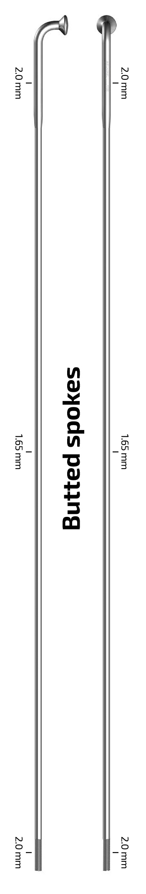

[Page d'accueil](./index.md)/[02. Composants](./02_components_fr.md)

# Roues
## Jantes
### Seido MAGNON Rim
Jante aluminium de voyage avec design asymmectric

 - ETRTO 25-622
 - Spoke count 32
 - Nipple seat diameter 599mm
 - ERD 602mm
 - Spoke offset 3.5mm
 - Tension max 110 - 130 kgf
 - Poids system max 150kg
 - Poids 533g
 - [Page officielle](https://seido-components.com/collections/rims/products/magnon-rim) 49.99 Euro
 - Revendeur:
    - [tradeinn.com](https://www.tradeinn.com/bikeinn/fr/seido-jante-magnon/140586357/p?srsltid=AfmBOopUtryeVpy76n-w7d3JwChH1oEUJdQdsUF7ZBZ74Hb_oHG-d76A) 44.99 CHF

### DT Swiss R500db
Jante aluminium de voyage

 - ETRTO 22-622
 - Spoke count 32
 - ERD 596mm
 - Poids system max 130kg
 - Poids 495g
 - [Page officielle](https://www.dtswiss.com/fr/composants/jantes-route/cross-road/r-500)
 - Revendeur:
    - [bike-discount.de](https://www.bike-discount.de/en/dt-swiss-r-500-28-disc-rim) 29.99 Euro
    - [r2-bike.com](https://r2-bike.com/DT-SWISS-Rim-28-R-500-DB-Disc-32-Holes) 27.31 Euro

### DT Swiss XM 421
Jante all mountain

 - ETRTO 25-622
 - Spoke count 32
 - ERD 602mm
 - Poids system max 120kg
 - poids 465g
 - [page officielle](https://www.dtswiss.com/fr/composants/jantes-vtt/all-mountain/xm-421) 99 Euro

## Rayons
### Sapim Spoke Race 2.0-1.8-2.0mm

 - 2.0mm - 1.8mm - 2.0mm
 - [Page officielle](https://www.sapim.be/spokes/butted/race)
 - Revendeur:
   - [wian-bike-and-parts.ch](https://www.wian-bike-and-parts.ch/produkt/sapim-speiche-race-2-0-1-8-2-0mmeinzelstueck-mit-nippel-messing-polyax-12mm-silber/) 1.20 CHF
   - [r2-bike.com](https://r2-bike.com/SAPIM-Spoke-Race-silver-302-mm) 0.42 Euro

### Sapim Spoke D-Light 2.0-1.65-2.0mm
Version un poil plus légère, bon compromis résistance/poid

 - 2.0mm - 1.65mm - 2.0mm
 - [Page officielle](https://www.sapim.be/spokes/butted/d-light)
 - Revendeur:
   - [wian-bike-and-parts.ch en noir](https://www.wian-bike-and-parts.ch/produkt/sapim-speiche-d-light-2-0-1-65-2-0mm-einzelstueck-mit-nippel-polyax-schwarz/) 1.95 CHF
   - [r2-bike.com](https://r2-bike.com/SAPIM-Spoke-D-Light-silver-288-mm) 0.42 Euro

### DT Swiss Competition
Butted spoke, medium strength

 - Butted 2.0mm - 1.8mm - 2.0mm
 - [Page officielle](https://www.dtswiss.com/fr/composants/rayons-et-ecrous/rayons/dt-competition)

### DT Swiss Competition Race
Butted spoke, version plus légère

 - Butted 2.0mm - 1.6mm - 2.0mm
 - [Page officielle](https://www.dtswiss.com/fr/composants/rayons-et-ecrous/rayons/dt-competition-race)

### DT Swiss Champion
Rayon droit, le plus solide

 - Straight 2.0mm
 - [Page officielle](https://www.dtswiss.com/fr/composants/rayons-et-ecrous/rayons/dt-champion)

## Écrous
### DT Swiss Standard
Écrous standard

 - [Page Officielle](https://www.dtswiss.com/fr/composants/rayons-et-ecrous/ecrous/dt-standard)

## Moyeux avant
### Velo Orange Disc Front Hub

 - 12mm/15mm x 100mm thru-axle
 - 32/36 holes
 - Disc 6-bolt
 - 160g
 - [Page officielle](https://velo-orange.com/collections/hubs/products/disc-front-hub-silver-and-noir) 78.00 $
 - Revendeur:
   - [voyage-shop.ch](https://www.voyage-shop.ch/Parts/Hubs/Velo-Orange-Disc-Front-Hub-Silver.htm?shop=fs_en&SessionId=&a=article&ProdNr=HU-0042&p=5683) 85.00 CHF

### Shimano 105 HB-R7070

 - 12 x 100mm
 - 32/36 holes
 - Disc direct-mount
 - 165g
 - [Page officielle](https://bike.shimano.com/fr-BE/products/components/pdp.P-HB-R7070.html)
 - Revendeur:
   - [bike24.fr](https://www.bike24.fr/produits/297450?sku=1037709) 54.44 Euro

### DT Swiss 350 Classic
Moyeu VTT

 - 12 x 110mm (boost)
 - 32 holes
 - Disc IS 6-bolt
 - 165g
 - Pitch Circle Diameter Left 58mm
 - Pitch Circle Diameter Right 52mm
 - Flange distance left 27.4mm
 - Flange distance right 40mm
 - Spoke hole diameter 2.6mm
 - [Page officielle](https://www.dtswiss.com/fr/composants/moyeux-et-rws/moyeux-vtt/350)

## Moyeux arrière
### Velo Orange Disc Rear Hub

 - 142mm Thru-Axle
 - 32/36 holes
 - Disc 6-bolts
 - Shimano HG (11s) / Sram XDR
 - 317g
 - [Page officielle](https://velo-orange.com/collections/hubs/products/disc-rear-hub-silver-and-noir) 180.00 $
 - Revendeur:
   - [voyage-shop.ch](https://www.voyage-shop.ch/Parts/Hubs/Velo-Orange-Disc-Rear-Hub-Silver.htm?shop=fs_en&SessionId=&a=article&ProdNr=HU-0038&p=5683) 199.00 CHF

### Shimano DEORE XT FH-M8110

 - 12 x 142mm
 - 28/32 holes
 - Disc direct-mount
 - Shimano MicroSpline
 - 305g
 - [Page officielle](https://bike.shimano.com/fr-FR/products/components/pdp.P-FH-M8110.html)
 - Revendeur:
   - [bike-components.de](https://www.bike-components.de/fr/Shimano/Moyeu-Arriere-XT-FH-M8110-Disc-Center-Lock-Axe-Traversant-12-mm-p71558/?v=71789-noir) 69.94 Euro

### Hope Pro 5
Hub de riche disponible dans plein de couleur et dans tout les standards.

 - 12 x 142mm
 - 24/28/32 holes
 - Disc 6-bolts / Centerlock
 - Shimano MicroSpline / HG / SRAM XDR
 - 313g
 - [Page officielle](https://www.hopetech.com/products/hubs/mountain-bike/pro-5-135-142mm-rear/)
 - Revendeur:
   - [bike24.fr](https://www.bike24.fr/produits/739914?sku=2530212) 262.18 Euro
   - [r2-bike.com](https://r2-bike.com/HOPE-Rear-Hub-Pro-5-Classic-Center-Lock-12x142-mm-thru-axle-Freehub-Shimano-Micro-Spline-silver) 216.39 Euro

### DT Swiss Hub 350 Classic
Hub VTT

 - 12 x 148mm / 12 x 142
 - 28/32 holes
 - Disc 6-bolts
 - Shimano MicroSpline / HG
 - 277g
 - Pitch circle diameter left 60mm
 - Pitch circle diameter right 50.5mm
 - Flange distance left 33.6mm
 - Flange distance right 20.4mm
 - Spoke hole diameter 2.6mm
 - [Page officielle](https://www.dtswiss.com/fr/composants/moyeux-et-rws/moyeux-vtt/350)
 - Revendeur:
   - [r2-bike.com](https://r2-bike.com/DT-SWISS-Rear-Hub-350-Classic-6-Hole-12x148-mm-BOOST-Thru-Axle-Freehub-Shimano-Micro-Spline) 157.56 Euro