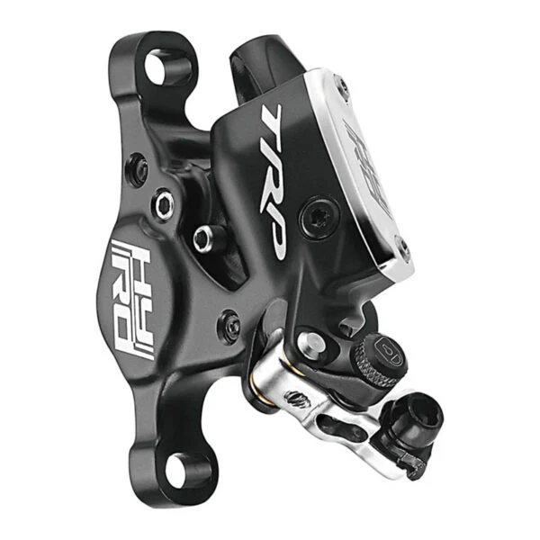

[Page d'accueil](./index.md)/[02. Composants](./02_components_fr.md)

# Freins
## Étriers
### Yokozuna Ultimo / Motoko
Marque japonaise de frein hydrolique hybride à cable performant.

Disponible en version **4 pistons Ultimo** en Flat mount ou Post mount mais seulement pour levier de frein de route **Short Pull**.
Ainsi qu'en version **2 pistons Motoko** en Post mount uniquement mais pour levier de frein VTT **Long Pull** (pour V-brakes) ou frein de route **Short Pull**.

 - Flat/Post mount
 - Hydrolique actionné par câble (hybride)
 - Short/Long pull
 - 2/4 pistons
 - Plaquettes Shimano D-type (Sainte/Zee) / Shimano A-Type (XTR/SLX)
 - 139g / 145g / pince de frein
 - Pages officielles: [Ultimo](https://www.yokozunausa.com/shop/yokozuna-ultimo-road-disc-brake-post-mount-2190) 329.99 $ / [Motoko](https://www.yokozunausa.com/shop/yokozuna-motoko-mtb-disc-brake-blk-post-mount-5839) 199.99 $
 - Revendeur:
   - [Ultimo voyage-shop.ch](https://www.voyage-shop.ch/Parts/Brakes/Yokozuna-Ultimo-Road-Disc-Brake-Post-Mount-Black-Rear.htm?shop=fs_en&SessionId=&a=article&ProdNr=730037&p=5718) 325.00 CHF
   - [Motoko voyage-shop.ch](https://www.voyage-shop.ch/Parts/Brakes/Yokozuna-Motoko-Road-Disc-Brake-Post-Mount-in-schwarz-Rear.htm?shop=fs_en&SessionId=&a=article&ProdNr=730013&p=5718) 159.00 CHF

### TRP HY/RD
Entreprise "familiale" plus petite basée à Taiwan.

 - Flat/Post mount
 - Hydrolique actionné par câble (hybride)
 - Short Pull
 - 2 pistons
 - Plaquettes Shimano M525/M515
 - 205g / pince de frein
 - [Page officielle](https://trpcycling.com/products/hy-rd?variant=47470289649951) 139.00 CHF

### Shimano SLX BR-M7120
Étrier 4 pistons VTT

 - Post mount
 - Hydrolique
 - 4 pistons
 - Plaquette Shimano N03A-RF Résine
 - 142 g / étrier
 - [Page officielle](https://bike.shimano.com/fr-FR/products/components/pdp.P-BR-M7120.html)
 - Revendeur:
   - [Galaxus](https://www.galaxus.ch/fr/s3/product/shimano-slx-br-m7120-pm-frein-arriere-frein-avant-avant-arriere-etrier-de-frein-4-frein-a-disque-21567295) CHF 55.90
   - [Fuchs-Movesa](https://www.fuchs-movesa.ch/fr/shop/composants-c1044/freins-c1068/freins-a-disques-c1128/etrier-de-frein-a-disque-c1364/shimano-etrier-de-frein-a-disque-slx-br-m7120-postmount-avantarriere-p913488) CHF 89.00

## Leviers de frein
Les leviers combinés avec shifters se trouvent dans la rubrique [02. Transmission](./0202_drivetrain_fr.md).

### Shimano SLX BL-M7100
Levier pour guidon droit de VTT.

 - Hydrolique
 - [Page officielle](https://bike.shimano.com/fr-FR/products/components/pdp.P-BL-M7100.html)
 - Revendeurs:
   - [Galaxus](https://www.galaxus.ch/fr/s3/product/shimano-slx-bl-m7100-frein-arriere-levier-de-frein-4-frein-a-disque-12422434) CHF 32.70
   - [Fuchs-Movesa](https://www.fuchs-movesa.ch/fr/shop/composants-c1044/freins-c1068/freins-a-disques-c1128/leviers-de-frein-c1370/shimano-levier-de-frein-slx-bl-m7100-disque-2-doigts-droit-p913799) CHF 49.50

### Shimano GRX BL-RX610-L
Levier de frein pour drop bar. En combinaison au GRX ST-RX610.

 - Hydraulique
 - drop bar
 - [Page officielle](https://bike.shimano.com/fr-FR/products/components/pdp.P-BL-RX610-L.html)
 - Revendeurs:
   - [Galaxus](https://www.galaxus.ch/fr/s3/product/shimano-grx-bl-rx610-liens-manette-de-vitesse-frein-37793181) CHF 115.-
   - [Fuchs-Movesa](https://www.fuchs-movesa.ch/fr/shop/composants-c1044/freins-c1068/freins-a-disques-c1128/leviers-de-frein-c1370/shimano-levier-de-frein-grx-bl-rx610-disque-gauche-p1243653) CHF 187.-

