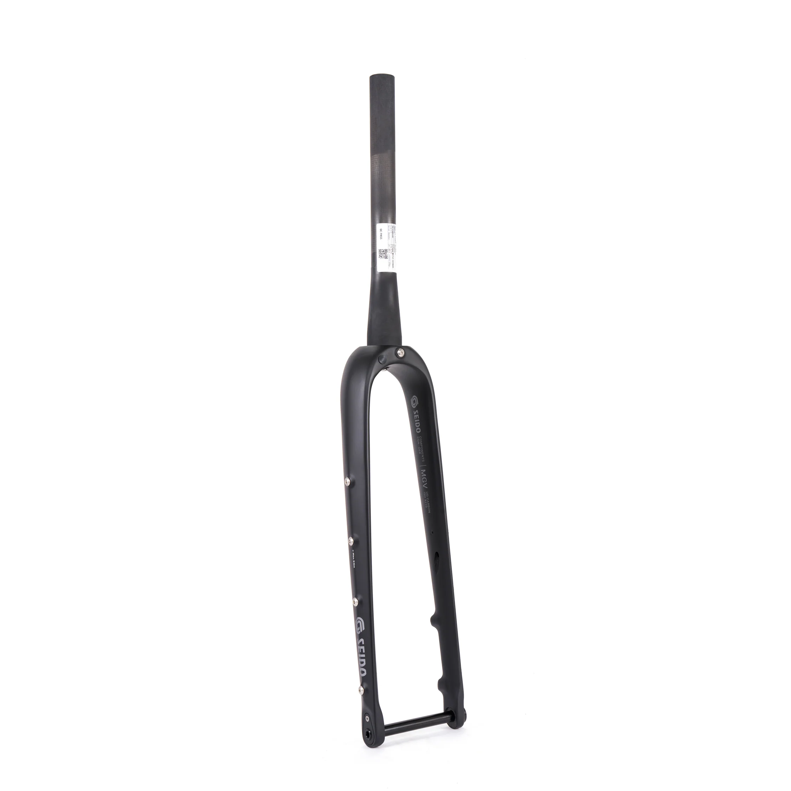
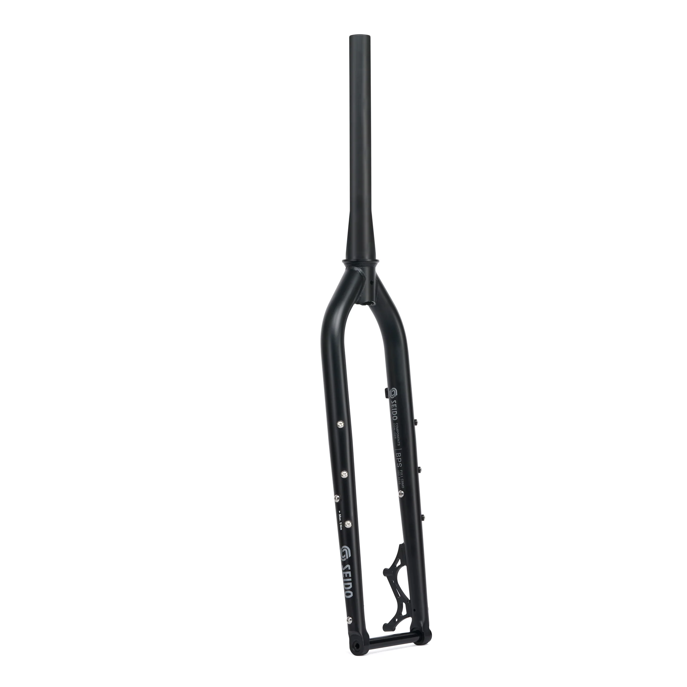
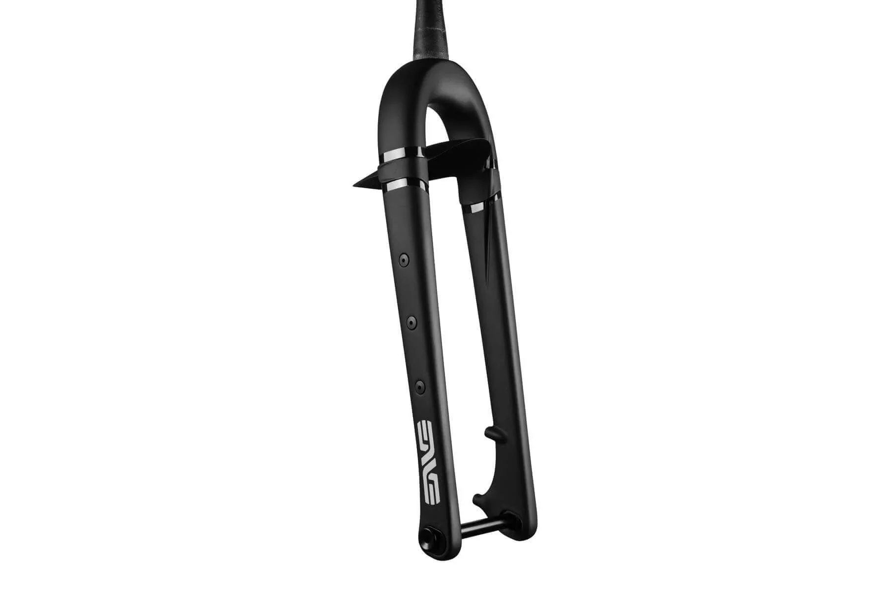
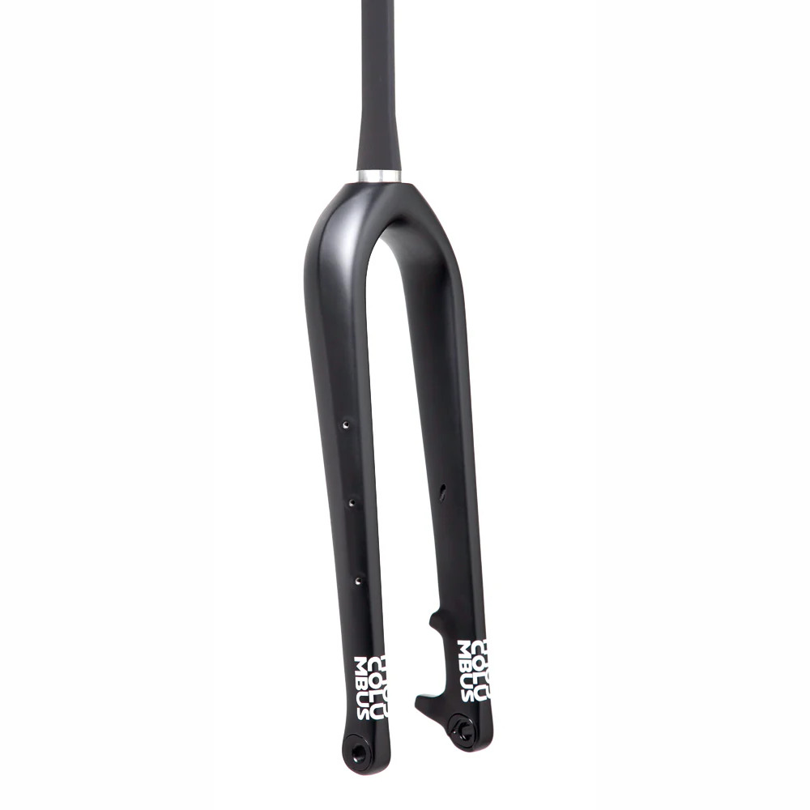
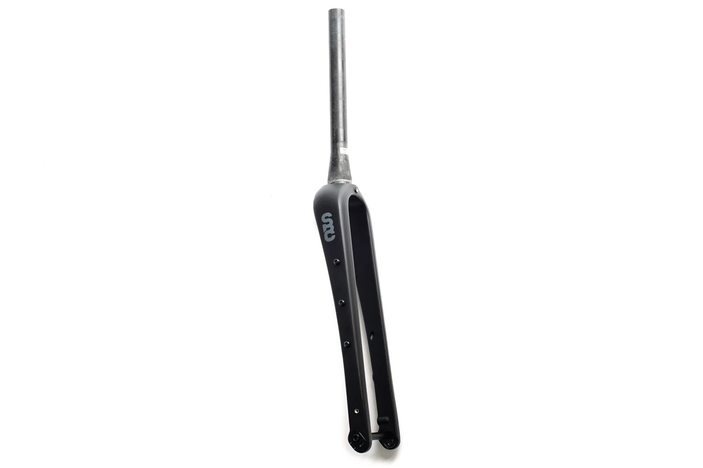
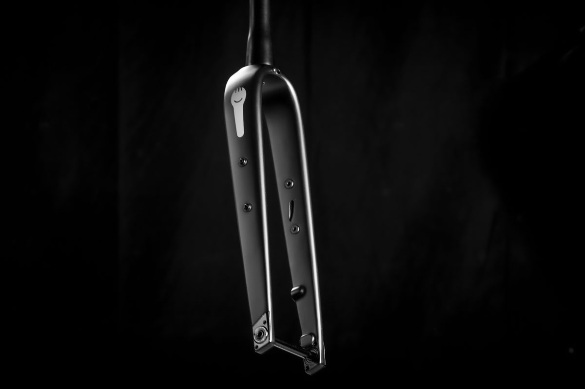

[Page d'accueil](./index.md)/[02. Composants](./02_components_fr.md)

# Fourches
## Seidon TAZA Fork
Fourche carbon ultime de voyage, heavy duty.

 - Tapered, 1-1/8" - 1-1/2"
 - S.H.I.S 28.6mm, 40mm
 - Offset 51mm
 - Axle to crown 510mm
 - Axe M15 x 1.5 x 110mm
 - Frein Post Mount 7", max 220mm disque
 - Support pneu 75-622 (29" x 3.0") / 75-584 (27.5" x 3.0")
 - Poids 656g + 58g pour l'axe
 - Poids system max 150kg
 - [Page officielle](https://seido-components.com/collections/mtb-forks/products/taza-fork) 645.99 Euro

## Seido MGV Fork
Fourche carbon légère de voyage

 - Tapered, 1-1/8" - 1-1/2"
 - S.H.I.S 28.6mm, 40mm
 - Offset 53mm
 - Axle to crown 410mm
 - Axe M12 x 1.5 x 100mm
 - Frein Flat Mount, max 180mm disque
 - Support pneu 58-622 (29" x 2.25") / 64-584 (27.5" x 2.5")
 - Poids 530g
 - Poids bagage max 18kg
 - [Page officielle](https://seido-components.com/collections/gravel-fork/products/mgv-fork) 375.99 Euro
 - Revendeur:
    - [tradeinn.com](https://www.tradeinn.com/bikeinn/en/seido-mgv-gravel-fork/141063459/p) 346.49 CHF
    - [alltricks.com](https://www.alltricks.com/F-11918-fourches/P-2386460-seido_mgv_27_5__disc_fork___12x100mm___53mm_offset) 349.99 Euro
    - [velofactory.ch](https://www.velofactory.ch/SEIDO-MGV-Fork-275-28-TA-12x100-410mm-A-C_1) 338 CHF

 ## Seido BPS Fork
 Fourche acier utlime de voyage, heavy duty.
 

 - Tapered, 1-1/8" - 1-1/2"
 - S.H.I.S 28.6mm, 40mm
 - Offset 51mm
 - Axle to crown 500mm
 - Axe M15 x 1.5 x 110mm
 - Frein Post Mount 6", max 203mm disque
 - Support pneu 75-622 (29" x 3.0") / 75-584 (27.5" x 3.0")
 - Poids 1694g
 - Poids system max 175kg
 - [Page officielle](https://seido-components.com/collections/mtb-forks/products/bps-fork) 309.99 Euro
 - Revendeur:
    - [tradeinn.com](https://www.tradeinn.com/bikeinn/en/seido-bps-gravel-fork/141063456/p) 283.99 CHF
    - [bikeimport.ch](https://bikeimport.ch/shop/product/41765) 256.75 CHF
    - [galaxus.ch](https://www.galaxus.ch/fr/s3/product/seido-bps-fork-ta-15mm-51mm-offset-fourche-velo-46596308) 306.00 CHF
    - [velofactory.ch](https://www.velofactory.ch/SEIDO-BPS-Fork-TA-15mm-51mm-offset_2) 288.00 CHF

## Enve Adventure Fork
Fourche carbon de voyage

 - Tapered, 1-1/8" - 1-1/2"
 - S.H.I.S 28.6mm, 40mm
 - Offset 49mm, 55.5mm
 - Axle to crown 398mm, 406mm
 - Axe M12 x 1.5 x 100mm
 - Frein Flat Mount, max 180mm disque
 - Support pneu 58-622 (29" x 2.3") / 64-584 (27.5" x 2.4")
 - Poids 575g
 - Poids bagage max 12kg
 - Poids system max 175kg
 - [Page officielle](https://eu.enve.com/fr/collections/gravel-cross-components/products/adventure-fork) 607.50 Euro
 - Revendeur:
    - [ciclimattio.com](https://ciclimattio.com/en/p/enve/adventure-fork--black-49-55-100mm) 535.58 CHF
    - [bike24.com](https://www.bike24.com/p2440227.html) 622.25 Euro
    - [alltricks.com](https://www.alltricks.com/F-11918-fourches/P-2208003-enve_adventure_fork_i_12x100_mm_i_carbon) 749 Euro

## Enve Mountain Fork BOOST
Fourche carbon VTT

 - Tapered, 1-1/8" - 1-1/2"
 - S.H.I.S 28.6mm, 40mm
 - Offset 44mm, 52mm
 - Axle to crown 470mm, 472mm
 - Axe M15 x 1.5 x 110mm
 - Frein Post Mount 6", max 180mm disque
 - Support pneu 75-622 (29" x 3.0")
 - Poids 676g
 - Poids bagage max inconnu
 - Poids system max inconnu
 - [Page officielle](https://eu.enve.com/fr/products/mountain-fork) 632.50 Euro
 - Revendeur:
    - [ciclimattio.com](https://ciclimattio.com/en/p/enve/mtn-29-1-1-2-taper-fork-black-44-52-110mm-29) 557.62 CHF
    - [r2-bike.com](https://r2-bike.com/ENVE-Fork-29-BOOST-Rigid-Fork-tapered-15-15x110-mm-Thru-Axle) 575.63 Euro

## Ritchey WCS CARBON TAPERED ADVENTURE GRAVEL FORK
Fourche carbon de voyage (existe en version pas Tapered)

 - Tapered, 1-1/8" - 1-1/2"
 - S.H.I.S 28.6mm, 40mm
 - Offset 50mm 
 - Axle to crown 393mm
 - Axe M12 x 1.5 x 100mm
 - Frein Flat Mount, max 180mm disque
 - Support pneu 65-622 (27.5" x 2.4")
 - Poids 530g (without axle)
 - Poids bagage max 6kg
 - Poids system max inconnu
 - [Page officielle](https://ritcheylogic.com/bike/forks/wcs-carbon-tapered-adventure-gravel-fork) 619.90 CHF
 - Revendeur:
    - [bikeimport.ch](https://bikeimport.ch/shop/product/42986) 408.85 CHF
    - [tradeinn.com](https://www.tradeinn.com/bikeinn/en/ritchey-wcs-carbon-tapered-adventure-12x100-mm-road-fork/139283826/p) 476.99 CHF
    - [velofactory.ch](https://www.velofactory.ch/Fourche-Ritchey-Gravel-Adventure-WCS-Carbon-12x100-1-1-8-1-1-5-axe-inclus) 513.00 CHF

## Ritchey WCS STEEL ADVENTURE FORK
Fourche acier de voyage

 - Straight, 1-1/8"
 - S.H.I.S 28.6mm, 30mm (crown diameter 35mm ???)
 - Offset 52mm 
 - Axle to crown 435mm
 - Axe M15 x 1.5 x 110mm
 - Frein Post Mount, max 180mm disque
 - Support pneu 52-622 (29" x 2.6")
 - Poids 1155g (without axle)
 - Poids bagage max 6kg
 - Poids system max inconnu
 - [Page officielle](https://ritcheylogic.com/bike/forks/wcs-steel-adventure-fork) 299.90 CHF

## Wilde Waypoint Carbon Fork
Fourche carbon de voyage

 - Brand origin and made in USA
 - Tapered, 1-1/8" - 1-1/2"
 - S.H.I.S 28.6mm, 40mm
 - Offset 49mm
 - Axle to crown 398mm
 - Axe M12 x 1.5 x 100mm
 - Frein Flat Mount, max 160mm disque
 - Support pneu 54-622 (29" x 2.1") 57-584 (27.5" x 2.3")
 - Poids 478g
 - Poids bagage max 6kg
 - Poids system max 115kg
 - [Page officielle](https://www.wildebikes.com/products/waypoint-carbon-fork-tapered) 462 CHF

## Colombus Futura Adventure
Fourche carbon de voyage

 - Brand origin Italy, Made in China
 - Tapered, 1-1/8" - 1-1/2"
 - S.H.I.S 28.6mm, 40mm
 - Offset 45mm, 50mm
 - Axle to crown 470mm
 - Axe M15 x 1.5 x 110mm
 - Frein Post Mount, max 180mm disque
 - Support pneu 54-622 (29" x 2.1") 57-584 (27.5" x 2.3")
 - Poids 767g
 - Poids bagage max 6kg
 - Poids system max inconnu
 - [Page officielle](https://www.columbus1919.com/en/portfolio/futura-adventure-en/)
 - Revendeur:
    - [bike24.com](https://www.bike24.com/p2509565.html) 567.74 Euro
    - [framebuildersupply.com](https://framebuildersupply.com/products/columbus-futura-adventure-disc-fork-painted) 657.00 CHF (620 CHF sans peinture)
    - [voyage-shop.ch](https://www.voyage-shop.ch/Parts/Fork/Columbus-Futura-Adventure-Fork.htm?shop=fs_en&SessionId=&a=article&ProdNr=FKCG0006&p=5714) 550.00 CHF
    - [ciclicorsa.com](https://ciclicorsa.com/fr/shop/futura-adventure-fork/) 594.00 Euro

## State Bicycle Co. Carbon Fiber Monster Gravel Fork V2
Fourche carbon de voyage

 - Brand origin Phoenix, USA
 - Tapered, 1-1/8" - 1-1/2"
 - S.H.I.S 28.6mm, 40mm
 - Offset 49mm, 55.5mm
 - Axle to crown 396mm, 404mm
 - Axe M12 x 1.5 x 100mm
 - Frein Flat Mount
 - Support pneu 55-622 (29" x 2.15") 57-584 (27.5" x 2.3")
 - Poids 510g
 - Poids bagage max 25kg
 - Poids system max inconnu
 - [Page officielle](https://www.statebicycle.com/products/state-bicycle-co-carbon-fiber-monster-gravel-fork) 278.00 CHF

## 8Bar GRAVEL - Carbon Disc Fork
Berlin based brand, travel carbon fork

 - 
 - Tapered, 1-1/8" - 1-1/2"
 - S.H.I.S 28.6mm, 40mm
 - Offset 50mm
 - Axle to crown 400mm
 - Axe M12 x 1.5 x 100mm
 - Frein Flat Mount, max 160mm disque
 - Support pneu 50-622 / (27.5" x 2.0")
 - Poids 450g
 - Poids bagage max pas de rack
 - Poids system max inconnu
 - [Page officielle](https://8bar-bikes.com/shop/gravel-carbon-disc-fork-3/) 252.10 Euro

## Rodeo Spork Series 3.3
Fourche carbon de voyage configurable

 - Brand origin Denver, USA
 - Tapered (or straight), 1-1/8" - 1-1/2" (1-1/8")
 - S.H.I.S 28.6mm, 40mm (30mm)
 - Offset 45mm, 50mm (48mm)
 - Axle to crown 396mm
 - Axe M12 (or M15) x 1.5 x 100mm
 - Frein Flat Mount, max 160mm disque
 - Support pneu 55-622 (29" x 2.1") 62-584 (27.5" x 2.4")
 - Poids 495g
 - Poids bagage max 12.5kg
 - Poids system max 135kg
 - [Page officielle](https://www.rodeo-labs.com/shop/forks/rodeo-labs-spork-3-0/) 465 $
