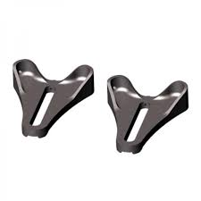

[Page d'accueil](./index.md)/[02. Composants](./02_components_fr.md)

# Cadres
## Tubes

## Dropouts
### Allotec C25
Slider dropout, compatible avec différentes plaques

 - 285g
 - [Page officielle](http://www.allotec.com.tw/Dropout91.html?CID=1_6)

### Allotec C151
Plaque pour slider

 - Sram UDH
 - Post-Mount Brake
 - Rotor 160mm
 - 148g
 - [Page officielle](http://www.allotec.com.tw/Dropout151.html?CID=1_6)

### Allotec C152
Plaque pour slider

 - Sram UDH
 - Flat-Mount brake
 - Rotor 160mm
 - 106g
 - [Page officielle](http://www.allotec.com.tw/Dropout152.html?CID=1_6)

### Allotec C82
Dropout minimaliste UDH.

 - SRAM UDH
 - 135 g (sans UDH)
 - [Page officielle](http://www.allotec.com.tw/Dropout82.html)
 - Revendeurs:
   - [Framebuilder Supply](https://framebuildersupply.com/collections/rear-dropouts/products/hooded-rear-thru-axle-dropout-for-sram-universal-derailleur-hanger) CHF 17.-
