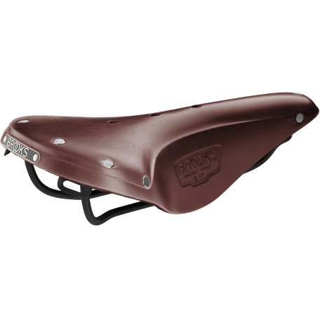
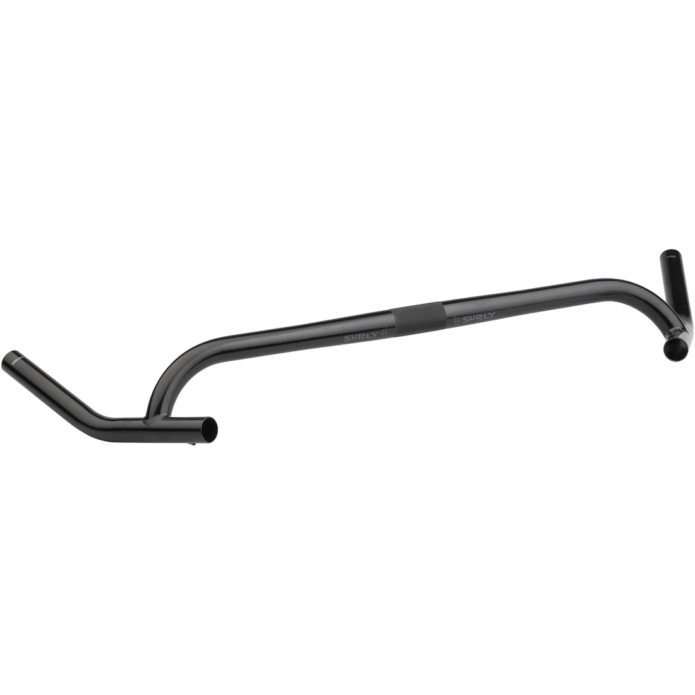
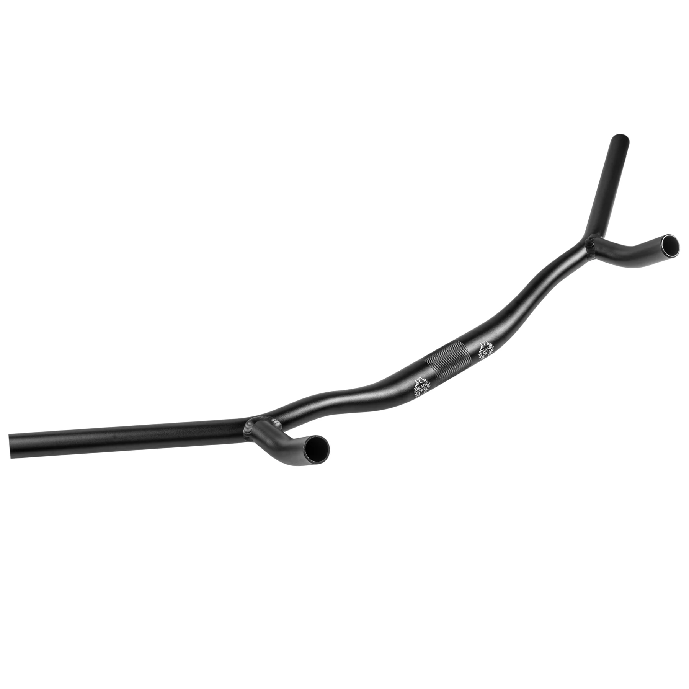
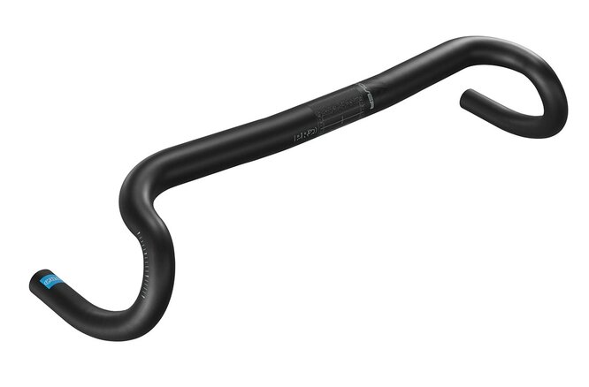
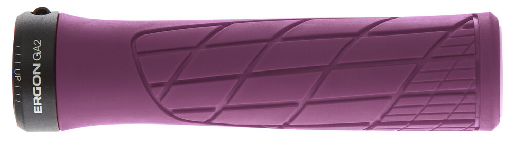
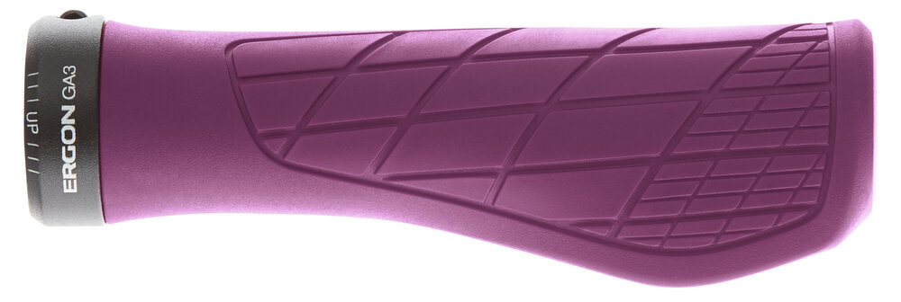

[Page d'accueil](./index.md)/[02. Composants](./02_components_fr.md)

# Points de contacts
## Pédales
### Seido PHASER Pedals
Pedales plates en alu 6061 usinées

 - Flat pedals
 - Size 113mm x 105mm
 - Poids 418g / paire
 - [Page officielle](https://seido-components.com/collections/platform/products/phaser-pedals) 94.99 Euro

### Seido SLICER Pedals
Pedales plates en alu 6061 usinées

 - Flat pedals
 - Size 105mm x 100mm x 18mm
 - Poids 388g / paire
 - [Page officielle](https://seido-components.com/collections/platform/products/slicer-pedals) 123.99 Euro

## Selles
### Brooks B17
Selle de voyage en cuir

 - Matériau : cuir
 - Poids : 510 g
 - [Page officielle](https://www.brooksengland.com/en_eu/b17.html) 150 Euro
 - Revendeurs:
   - [Galaxus](https://www.galaxus.ch/fr/s3/product/brooks-england-b17-standard-selle-de-velo-431256) CHF 98.90

### Brooks C17
Selle plus ville

 - Matériau : synthétique
 - Poids : 446 g
 - [Page officielle](https://www.brooksengland.com/en_eu/c17.html) 130 USD
 - Revendeurs:
   - [Galaxus](https://www.galaxus.ch/fr/s3/product/brooks-england-cambium-c17-selle-de-velo-6881467) CHF 93.90

## Guidons
### Ritchey WCS Beacon
Guidon de course gravel très incliné pour le confort longue distance.

 - Matériau : Alu 7050
 - Chute : 80 mm
 - Serrage : 31.8 mm
 - Largeur : 400 mm / 420 mm / 440 mm / 460 mm
 - Poids : 270 g (420 mm)
 - [Page officielle](https://ritcheylogic.com/bike/handlebars/wcs-beacon-handlebar) CHF 99.90
 - Revendeurs:
   - [Galaxus](https://www.galaxus.ch/fr/s3/product/ritchey-wcs-beacon-road-3180-mm-guidon-15669466) CHF 81.-
   - [VeloFactory](https://www.velofactory.ch/Guidon-Ritchey-Road-WCS-Beacon-44cm-c-c-en-haut-Blatte-black-318mm-Di2-internal-routing) CHF 80.20

### Surly Corner Bar
Guidon genre drop bar mais compatible avec frein et shifter flat bar.

 - Matériau : Acier Chromoly
 - Serrage : 25.4 mm
 - Diamètre guidon : 22.2 mm
 - Largeur : 460 mm / 500 mm / 540 mm
 - Poids : 720 g
 - [Manuel](./docs/Surly_Corner_Bar_Manual.pdf)
 - [Page officielle](https://surlybikes.com/products/corner-bar) 100.00 USD

### Velo Orange Crazy Bar 2
Guidon droit avec trois positions, compatible avec freins et shifters pour flat bar en répliquant la position sur les cocottes.

 - Matériau : Alu 6061
 - Serrage : 31.8 mm
 - Largeur : 780 mm
 - Largeur poignée : 205 mm
 - Diamètre guidon : 22.2 mm
 - Poids : 532 g
 - [Page officielle](https://velo-orange.com/products/crazy-bars-2) 120.00 USD

### PRO Discover OS
Guidon de course standard.

 - Matériau : Alu
 - Drop : 100 mm
 - Largeur : 400 mm / 420 mm / 440 mm
 - Poids : 265 g
 - Revendeurs :
   - [Fuchs-movesa](https://www.fuchs-movesa.ch/fr/shop/composants-c1044/cintres--potences-c1218/guidons-c1354/guidons-modeles-c1355/pro-guidon-discover-os-40cm-20-sweep-318-mm-alu-noir-p2987255) CHF 38.- (version carbon à CHF 200.- / 195 g)

## Potence

## Poignées
### Ergon GA2
Poignée normal synthétique

 - Poids : 110 g
 - Revendeurs :
   - [Fuchs-movesa](https://www.fuchs-movesa.ch/fr/shop/accessoires-de-velo-c1040/poignees-de-guidon--guidoline-c1104/poignees-du-guidon-c1105/ergon-poignees-ga2-purple-reign-p905282) CHF 32.90

### Ergon GA3
Poignée large synthétique

 - Poids : 115 g
 - Revendeurs :
   - [Fuchs-movesa](https://www.fuchs-movesa.ch/fr/shop/accessoires-de-velo-c1040/poignees-de-guidon--guidoline-c1104/poignees-du-guidon-c1105/ergon-poignees-ga3-small-purple-reign-p905290) CHF 36.90
