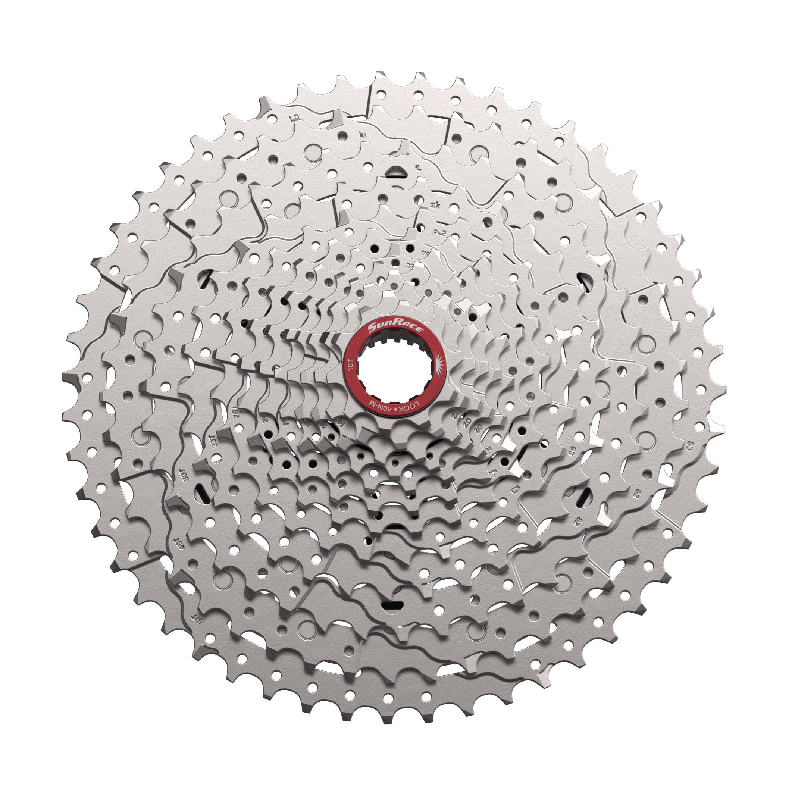
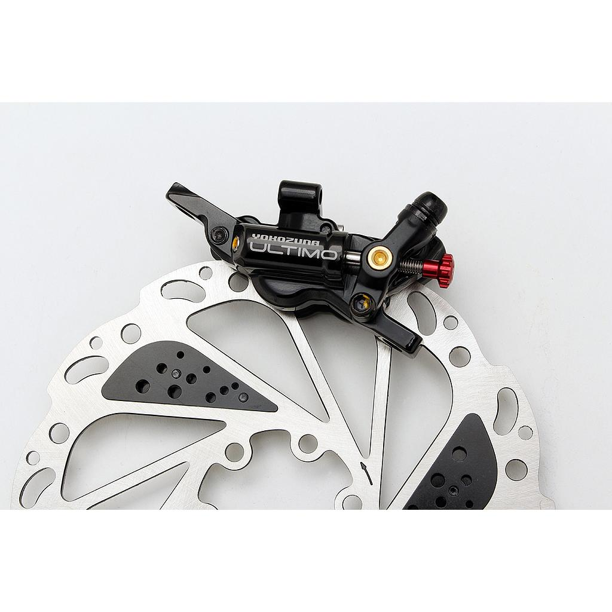

[Page d'accueil](./index.md)

# Composants
Tous les composents sont méticuleusements choisis pour répondre à des exigences de qualité précis. Ces choix sont justifiés ici afin de faire prendre contience l'aspect technique et de permettre le client de devenir consomacteur.

## Motorisation
### Grin Rear V3 All-Axle Hub slow HG
Moteur moyen pour roue arrière

 - 142/148mm Thru-Axle
 - 135 Quick-release
 - Shimano HG (10s) or SRAM XD
 - 4.25kg
 - avec batterie 36V:
   - couple max sur la roue 75.7Nm
   - puissance batterie max 1255W/35A/36V
 - [Page officielle](https://ebikes.ca/product-info/grin-products/all-axle-hub-motor.html) USD$ 785.- avec adapter, statorade, et 250W laser mark

### Grin Baserunner L10 Controller
Controler de moteur indépendant passant dans le support de batterie

 - Compatible avec batterie 24V-52V (max 60V)
 - 80 A en pic, 45-50A continu
 - Passe dans support de batterie Hailong (out of stock) et Reention
 - [Page officielle](https://ebikes.ca/shop/electric-bicycle-parts/controllers/baserunner-l10-motor-controller.html) USD$ 270.- avec baseplate

### Dali BMS Model H
BMS pour batterie custom

 - 40A max discharge/charge
 - 10/13/14s
 - [Page "officielle"](https://www.dalybms.com/18650-bms-h-series-standard-bms-3s-to-16s-40a-60a-product/)

### Reention Polly DP-6C
Boîtier pour batterie custom

 - 65 cellules 18650
 - 10s6p (~36V 20.4Ah) ou 13s5p (48V(46.8V) 17Ah)
 - Alternative:
   - Polly DP-9C (84 cellules 10s8p, 13s6p, 14s6p)
   - Polly DP-5C (52 cellules 10s5p, 13s4p)
 - Baserunner fit
 - Revendeur:
   - [topbikekit](https://topbikekit.com/pollydp6c-battery-case-65pcs-18650-cells-with-inner-9-tube-controller-p-765.html) USD$ 26.-

### Samsung INR18650-35E
Cellule

 - Rated capacity 3500 mAh (min 3350 mAh)
 - Measured capacity :
   - 3400 mAh @ 0.2 A
   - 3380 mAh @ 0.5 A
   - 3360 mAh @ 1.0 A
   - 3330 mAh @ 2.0 A
   - 3300 mAh @ 3.0 A
   - 3260 mAh @ 5.0 A
 - Max continuous discharge current 8.0 A
 - Max charging current 2.0 A
 - Weight 48g
 - Revendeur:
   - [nkon.nl](https://www.nkon.nl/en/samsung-inr18650-35e.html) €2.34 (€2.09 pour 100, €1.99 pour 200, €1.84 pour 600)

### Grin Technology : FreeGen Motor
Le coeur des eBikes Concretely Screwed est son moteur à récupération d'énergie FreeGen. Grin Technology est une petite entreprise basée à Vancouver fabriquant des moteurs et des contrôleurs pour vélo de grande qualité. Il s'agit d'un bureau d'ingénieurs passionnés par le vélo proposant des solutions idéales pour des projets complétement sur mesure.

Avec le FreeGen, ils ont créé une révolution dans le monde du eBike en apportant pour la première fois une solution sans compromis permettant de récupéré de l'énergie.

Par une élégante solution, il propose un moteur qui promet :
- de diminuer l'usure des freins grâce à la régénération d'énergie
- d'augmenter l'autonomie de la batterie
- de réduire l'usure sur la transmission
- un contrôle transparent pour l'utilisateur qui ne verra pas la différence entre freiné en dissipant l'énergie ou en la récupérant
- un vrai roue-libre
- pas d'inversion de la contrainte sur l'axe de la roue

Bref, toutes les problèmes qui font que la régénération d'énergie sur vélo éléctrique n'est aujourd'hui pas plus répandues sont résolu. Il était donc évident d'intégrer cette technologie dans les eBikes Conctretely Screwed

 - [Page officielle](https://ebikes.ca/)

## Pinion P1.18
Avec ces 18 rapports espacé linéairement sur 636%, la boite à vitesse P1.18 de Pinion est simplement ce qui se fait de mieux. Que ce soit dans les montées ou dans les descentes, la plage de rapport disponible sera parfaite en toute circomstance. Couplée à une transmission à courroie, il s'agit de la solution demandant le moins d'entretien. Fini la graisse sur les pantalons, les courroies se nettoient à l'eau et dûre environ 10'000 km, et certainement plus avec un moteur dans la roue arrière qui va réduire la force passant par la transmission.

- [Page officielle](https://pinion.eu/en/p-line/)

## Dropout
### Allotec C25
Slider dropout, compatible avec différentes plaques

 - 285g
 - [Page officielle](http://www.allotec.com.tw/Dropout91.html?CID=1_6)

### Allotec C151
Plaque pour slider

 - Sram UDH
 - Post-Mount Brake
 - Rotor 160mm
 - 148g
 - [Page officielle](http://www.allotec.com.tw/Dropout151.html?CID=1_6)

### Allotec C152
Plaque pour slider

 - Sram UDH
 - Flat-Mount brake
 - Rotor 160mm
 - 106g
 - [Page officielle](http://www.allotec.com.tw/Dropout152.html?CID=1_6)

## Fourches
### Seidon TAZA Fork
Fourche carbon ultime de voyage, heavy duty.

 - Tapered, 1-1/8" - 1-1/2"
 - S.H.I.S 28.6mm, 40mm
 - Offset 51mm
 - Axle to crown 510mm
 - Axe M15 x 1.5 x 110mm
 - Frein Post Mount 7", max 220mm disque
 - Support pneu 75-622 (29" x 3.0") / 75-584 (27.5" x 3.0")
 - Poids 656g + 58g pour l'axe
 - Poids system max 150kg
 - [Page officielle](https://seido-components.com/collections/mtb-forks/products/taza-fork) 645.99 Euro

### Seido MGV Fork
Fourche carbon légère de voyage

 - Tapered, 1-1/8" - 1-1/2"
 - S.H.I.S 28.6mm, 40mm
 - Offset 53mm
 - Axle to crown 410mm
 - Axe M12 x 1.5 x 100mm
 - Frein Flat Mount, max 180mm disque
 - Support pneu 58-622 (29" x 2.25") / 64-584 (27.5" x 2.5")
 - Poids 530g
 - Poids bagage max 18kg
 - [Page officielle](https://seido-components.com/collections/gravel-fork/products/mgv-fork) 375.99 Euro
 - Revendeur:
    - [tradeinn.com](https://www.tradeinn.com/bikeinn/en/seido-mgv-gravel-fork/141063459/p) 346.49 CHF
    - [alltricks.com](https://www.alltricks.com/F-11918-fourches/P-2386460-seido_mgv_27_5__disc_fork___12x100mm___53mm_offset) 349.99 Euro
    - [velofactory.ch](https://www.velofactory.ch/SEIDO-MGV-Fork-275-28-TA-12x100-410mm-A-C_1) 338 CHF

 ### Seido BPS Fork
 Fourche acier utlime de voyage, heavy duty.
 

 - Tapered, 1-1/8" - 1-1/2"
 - S.H.I.S 28.6mm, 40mm
 - Offset 51mm
 - Axle to crown 500mm
 - Axe M15 x 1.5 x 110mm
 - Frein Post Mount 6", max 203mm disque
 - Support pneu 75-622 (29" x 3.0") / 75-584 (27.5" x 3.0")
 - Poids 1694g
 - Poids system max 175kg
 - [Page officielle](https://seido-components.com/collections/mtb-forks/products/bps-fork) 309.99 Euro
 - Revendeur:
    - [tradeinn.com](https://www.tradeinn.com/bikeinn/en/seido-bps-gravel-fork/141063456/p) 283.99 CHF
    - [bikeimport.ch](https://bikeimport.ch/shop/product/41765) 256.75 CHF
    - [galaxus.ch](https://www.galaxus.ch/fr/s3/product/seido-bps-fork-ta-15mm-51mm-offset-fourche-velo-46596308) 306.00 CHF
    - [velofactory.ch](https://www.velofactory.ch/SEIDO-BPS-Fork-TA-15mm-51mm-offset_2) 288.00 CHF

### Enve Adventure Fork
Fourche carbon de voyage

 - Tapered, 1-1/8" - 1-1/2"
 - S.H.I.S 28.6mm, 40mm
 - Offset 49mm, 55.5mm
 - Axle to crown 398mm, 406mm
 - Axe M12 x 1.5 x 100mm
 - Frein Flat Mount, max 180mm disque
 - Support pneu 58-622 (29" x 2.3") / 64-584 (27.5" x 2.4")
 - Poids 575g
 - Poids bagage max 12kg
 - Poids system max 175kg
 - [Page officielle](https://eu.enve.com/fr/collections/gravel-cross-components/products/adventure-fork) 607.50 Euro
 - Revendeur:
    - [ciclimattio.com](https://ciclimattio.com/en/p/enve/adventure-fork--black-49-55-100mm) 535.58 CHF
    - [bike24.com](https://www.bike24.com/p2440227.html) 622.25 Euro
    - [alltricks.com](https://www.alltricks.com/F-11918-fourches/P-2208003-enve_adventure_fork_i_12x100_mm_i_carbon) 749 Euro

### Enve Mountain Fork BOOST
Fourche carbon VTT

 - Tapered, 1-1/8" - 1-1/2"
 - S.H.I.S 28.6mm, 40mm
 - Offset 44mm, 52mm
 - Axle to crown 470mm, 472mm
 - Axe M15 x 1.5 x 110mm
 - Frein Post Mount 6", max 180mm disque
 - Support pneu 75-622 (29" x 3.0")
 - Poids 676g
 - Poids bagage max inconnu
 - Poids system max inconnu
 - [Page officielle](https://eu.enve.com/fr/products/mountain-fork) 632.50 Euro
 - Revendeur:
    - [ciclimattio.com](https://ciclimattio.com/en/p/enve/mtn-29-1-1-2-taper-fork-black-44-52-110mm-29) 557.62 CHF
    - [r2-bike.com](https://r2-bike.com/ENVE-Fork-29-BOOST-Rigid-Fork-tapered-15-15x110-mm-Thru-Axle) 575.63 Euro

### Ritchey WCS CARBON TAPERED ADVENTURE GRAVEL FORK
Fourche carbon de voyage (existe en version pas Tapered)

 - Tapered, 1-1/8" - 1-1/2"
 - S.H.I.S 28.6mm, 40mm
 - Offset 50mm 
 - Axle to crown 393mm
 - Axe M12 x 1.5 x 100mm
 - Frein Flat Mount, max 180mm disque
 - Support pneu 65-622 (27.5" x 2.4")
 - Poids 530g (without axle)
 - Poids bagage max 6kg
 - Poids system max inconnu
 - [Page officielle](https://ritcheylogic.com/bike/forks/wcs-carbon-tapered-adventure-gravel-fork) 619.90 CHF
 - Revendeur:
    - [bikeimport.ch](https://bikeimport.ch/shop/product/42986) 408.85 CHF
    - [tradeinn.com](https://www.tradeinn.com/bikeinn/en/ritchey-wcs-carbon-tapered-adventure-12x100-mm-road-fork/139283826/p) 476.99 CHF
    - [velofactory.ch](https://www.velofactory.ch/Fourche-Ritchey-Gravel-Adventure-WCS-Carbon-12x100-1-1-8-1-1-5-axe-inclus) 513.00 CHF

### Ritchey WCS STEEL ADVENTURE FORK
Fourche acier de voyage

 - Straight, 1-1/8"
 - S.H.I.S 28.6mm, 30mm (crown diameter 35mm ???)
 - Offset 52mm 
 - Axle to crown 435mm
 - Axe M15 x 1.5 x 110mm
 - Frein Post Mount, max 180mm disque
 - Support pneu 52-622 (29" x 2.6")
 - Poids 1155g (without axle)
 - Poids bagage max 6kg
 - Poids system max inconnu
 - [Page officielle](https://ritcheylogic.com/bike/forks/wcs-steel-adventure-fork) 299.90 CHF

### Wilde Waypoint Carbon Fork
Fourche carbon de voyage

 - Brand origin and made in USA
 - Tapered, 1-1/8" - 1-1/2"
 - S.H.I.S 28.6mm, 40mm
 - Offset 49mm
 - Axle to crown 398mm
 - Axe M12 x 1.5 x 100mm
 - Frein Flat Mount, max 160mm disque
 - Support pneu 54-622 (29" x 2.1") 57-584 (27.5" x 2.3")
 - Poids 478g
 - Poids bagage max 6kg
 - Poids system max 115kg
 - [Page officielle](https://www.wildebikes.com/products/waypoint-carbon-fork-tapered) 462 CHF

### Colombus Futura Adventure
Fourche carbon de voyage

 - Brand origin Italy, Made in China
 - Tapered, 1-1/8" - 1-1/2"
 - S.H.I.S 28.6mm, 40mm
 - Offset 45mm, 50mm
 - Axle to crown 470mm
 - Axe M15 x 1.5 x 110mm
 - Frein Post Mount, max 180mm disque
 - Support pneu 54-622 (29" x 2.1") 57-584 (27.5" x 2.3")
 - Poids 767g
 - Poids bagage max 6kg
 - Poids system max inconnu
 - [Page officielle](https://www.columbus1919.com/en/portfolio/futura-adventure-en/)
 - Revendeur:
    - [bike24.com](https://www.bike24.com/p2509565.html) 567.74 Euro
    - [framebuildersupply.com](https://framebuildersupply.com/products/columbus-futura-adventure-disc-fork-painted) 657.00 CHF (620 CHF sans peinture)
    - [voyage-shop.ch](https://www.voyage-shop.ch/Parts/Fork/Columbus-Futura-Adventure-Fork.htm?shop=fs_en&SessionId=&a=article&ProdNr=FKCG0006&p=5714) 550.00 CHF
    - [ciclicorsa.com](https://ciclicorsa.com/fr/shop/futura-adventure-fork/) 594.00 Euro

### State Bicycle Co. Carbon Fiber Monster Gravel Fork V2
Fourche carbon de voyage

 - Brand origin Phoenix, USA
 - Tapered, 1-1/8" - 1-1/2"
 - S.H.I.S 28.6mm, 40mm
 - Offset 49mm, 55.5mm
 - Axle to crown 396mm, 404mm
 - Axe M12 x 1.5 x 100mm
 - Frein Flat Mount
 - Support pneu 55-622 (29" x 2.15") 57-584 (27.5" x 2.3")
 - Poids 510g
 - Poids bagage max 25kg
 - Poids system max inconnu
 - [Page officielle](https://www.statebicycle.com/products/state-bicycle-co-carbon-fiber-monster-gravel-fork) 278.00 CHF

### 8Bar GRAVEL - Carbon Disc Fork
Berlin based brand, travel carbon fork

 - 
 - Tapered, 1-1/8" - 1-1/2"
 - S.H.I.S 28.6mm, 40mm
 - Offset 50mm
 - Axle to crown 400mm
 - Axe M12 x 1.5 x 100mm
 - Frein Flat Mount, max 160mm disque
 - Support pneu 50-622 / (27.5" x 2.0")
 - Poids 450g
 - Poids bagage max pas de rack
 - Poids system max inconnu
 - [Page officielle](https://8bar-bikes.com/shop/gravel-carbon-disc-fork-3/) 252.10 Euro

### Rodeo Spork Series 3.3
Fourche carbon de voyage configurable

 - Brand origin Denver, USA
 - Tapered (or straight), 1-1/8" - 1-1/2" (1-1/8")
 - S.H.I.S 28.6mm, 40mm (30mm)
 - Offset 45mm, 50mm (48mm)
 - Axle to crown 396mm
 - Axe M12 (or M15) x 1.5 x 100mm
 - Frein Flat Mount, max 160mm disque
 - Support pneu 55-622 (29" x 2.1") 62-584 (27.5" x 2.4")
 - Poids 495g
 - Poids bagage max 12.5kg
 - Poids system max 135kg
 - [Page officielle](https://www.rodeo-labs.com/shop/forks/rodeo-labs-spork-3-0/) 465 $

## Derailleurs
### Ingrid RD-1 Derailleur
Derailleur fait en Italie multi-compatible (SRAM/Shimano/road/mtn/11s/12s)

[Page officielle](https://ingrid.bike/product/rear-derailleur-rd1/) 599 Euro

### TRP EVO 12 Derailleur
Derailleur compatible Shimano 12 vittesses VTT microspline.

[TRP EVO 12 Derailleur](./pics/TRP-EVO_12_Derailleur.webp)

 - 12 speeds
 - Max 52T
 - 300g
 - [Page officielle](https://trpcycling.com/products/evo-12-derailleur) 222.00 CHF

## Pédales
### Seido PHASER Pedals
Pedales plates en alu 6061 usinées

 - Flat pedals
 - Size 113mm x 105mm
 - Poids 418g / paire
 - [Page officielle](https://seido-components.com/collections/platform/products/phaser-pedals) 94.99 Euro

### Seido SLICER Pedals
Pedales plates en alu 6061 usinées

 - Flat pedals
 - Size 105mm x 100mm x 18mm
 - Poids 388g / paire
 - [Page officielle](https://seido-components.com/collections/platform/products/slicer-pedals) 123.99 Euro

## Shifter
### Gevenalle GX Shifter
Dropbar shifter compatible avec derailleur 12s et frein à cable

 - Brand origin Portland, USA, assembled in Portland from USA and Taiwan parts
 - Short cable pull for road brakes
 - 12s Shimano or SRAM compatible
 - [Page officielle](https://www.gevenalle.com/product/gx/) 189 $

## Cassette
### SunRace CSMZ930 / CSMZ932 / CSMZ933
Cassette compatible Shimano Microspline donc VTT 12 vitesses avec 10 dents sur petit pignon.

 - Shimano microspline
 - 12 speeds
 - 10-51
 - 675g / 563g / 526g
 - Pages officielles: [CSMZ930](https://sunrace.com/product/csmz930-microspline/) / [CSMZ932](https://sunrace.com/product/csmz932-microspline/) / [CSMZ933](https://sunrace.com/product/csmz933-microspline/)
 - Revendeur:
   - [CSMZ930 bike-discount.de](https://www.bike-discount.de/fr/sunrace-cassette-csmz932-12-vitesses-10-51)

### TRP EVO 12 Cassette
Cassette compatible Shimano Microspline.

 - Shimano Microspline
 - Disponible en noir et or
 - 12 speeds
 - 10-52
 - 372g
 - [Page officielle](https://trpcycling.com/products/evo-12-cassette) 370.00 CHF

## Freins
### Yokozuna Ultimo / Motoko
Marque japonaise de frein hydrolique hybride à cable performant.

Disponible en version **4 pistons Ultimo** en Flat mount ou Post mount mais seulement pour levier de frein de route **Short Pull**.
Ainsi qu'en version **2 pistons Motoko** en Post mount uniquement mais pour levier de frein VTT **Long Pull** (pour V-brakes) ou frein de route **Short Pull**.

 - Flat/Post mount
 - Hydrolique actionné par câble (hybride)
 - Short/Long pull
 - 2/4 pistons
 - Plaquettes Shimano D-type (Sainte/Zee) / Shimano A-Type (XTR/SLX)
 - 139g / 145g / pince de frein
 - Pages officielles: [Ultimo](https://www.yokozunausa.com/shop/yokozuna-ultimo-road-disc-brake-post-mount-2190) 329.99 $ / [Motoko](https://www.yokozunausa.com/shop/yokozuna-motoko-mtb-disc-brake-blk-post-mount-5839) 199.99 $
 - Revendeur:
   - [Ultimo voyage-shop.ch](https://www.voyage-shop.ch/Parts/Brakes/Yokozuna-Ultimo-Road-Disc-Brake-Post-Mount-Black-Rear.htm?shop=fs_en&SessionId=&a=article&ProdNr=730037&p=5718) 325.00 CHF
   - [Motoko voyage-shop.ch](https://www.voyage-shop.ch/Parts/Brakes/Yokozuna-Motoko-Road-Disc-Brake-Post-Mount-in-schwarz-Rear.htm?shop=fs_en&SessionId=&a=article&ProdNr=730013&p=5718) 159.00 CHF

### TRP HY/RD
Entreprise "familiale" plus petite basée à Taiwan.

 - Flat/Post mount
 - Hydrolique actionné par câble (hybride)
 - Short Pull
 - 2 pistons
 - Plaquettes Shimano M525/M515
 - 205g / pince de frein
 - [Page officielle](https://trpcycling.com/products/hy-rd?variant=47470289649951) 139.00 CHF

## Roues
### Moyeux arrière
#### Velo Orange Disc Rear Hub

 - 142mm Thru-Axle
 - 32/36 holes
 - Disc 6-bolts
 - Shimano HG (11s) / Sram XDR
 - 317g
 - [Page officielle](https://velo-orange.com/collections/hubs/products/disc-rear-hub-silver-and-noir) 180.00 $
 - Revendeur:
   - [voyage-shop.ch](https://www.voyage-shop.ch/Parts/Hubs/Velo-Orange-Disc-Rear-Hub-Silver.htm?shop=fs_en&SessionId=&a=article&ProdNr=HU-0038&p=5683) 199.00 CHF

#### Shimano DEORE XT FH-M8110

 - 12 x 142mm
 - 28/32 holes
 - Disc direct-mount
 - Shimano MicroSpline
 - 305g
 - [Page officielle](https://bike.shimano.com/fr-FR/products/components/pdp.P-FH-M8110.html)
 - Revendeur:
   - [bike-components.de](https://www.bike-components.de/fr/Shimano/Moyeu-Arriere-XT-FH-M8110-Disc-Center-Lock-Axe-Traversant-12-mm-p71558/?v=71789-noir) 69.94 Euro

#### Hope Pro 5
Hub de riche disponible dans plein de couleur et dans tout les standards.

 - 12 x 142mm
 - 24/28/32 holes
 - Disc 6-bolts / Centerlock
 - Shimano MicroSpline / HG / SRAM XDR
 - 313g
 - [Page officielle](https://www.hopetech.com/products/hubs/mountain-bike/pro-5-135-142mm-rear/)
 - Revendeur:
   - [bike24.fr](https://www.bike24.fr/produits/739914?sku=2530212) 262.18 Euro
   - [r2-bike.com](https://r2-bike.com/HOPE-Rear-Hub-Pro-5-Classic-Center-Lock-12x142-mm-thru-axle-Freehub-Shimano-Micro-Spline-silver) 216.39 Euro

#### DT Swiss Hub 350 Classic

 - 12 x 148mm / 12 x 142
 - 28/32 holes
 - Disc 6-bolts
 - Shimano MicroSpline / HG
 - 277g
 - Pitch circle diameter left 60mm
 - Pitch circle diameter right 50.5mm
 - Flange distance left 33.6mm
 - Flange distance right 20.4mm
 - Spoke hole diameter 2.6mm
 - [Page officielle](https://www.dtswiss.com/fr/composants/moyeux-et-rws/moyeux-vtt/350)
 - Revendeur:
   - [r2-bike.com](https://r2-bike.com/DT-SWISS-Rear-Hub-350-Classic-6-Hole-12x148-mm-BOOST-Thru-Axle-Freehub-Shimano-Micro-Spline) 157.56 Euro

### Moyeux avant
#### Velo Orange Disc Front Hub

 - 12mm/15mm x 100mm thru-axle
 - 32/36 holes
 - Disc 6-bolt
 - 160g
 - [Page officielle](https://velo-orange.com/collections/hubs/products/disc-front-hub-silver-and-noir) 78.00 $
 - Revendeur:
   - [voyage-shop.ch](https://www.voyage-shop.ch/Parts/Hubs/Velo-Orange-Disc-Front-Hub-Silver.htm?shop=fs_en&SessionId=&a=article&ProdNr=HU-0042&p=5683) 85.00 CHF

#### Shimano 105 HB-R7070

 - 12 x 100mm
 - 32/36 holes
 - Disc direct-mount
 - 165g
 - [Page officielle](https://bike.shimano.com/fr-BE/products/components/pdp.P-HB-R7070.html)
 - Revendeur:
   - [bike24.fr](https://www.bike24.fr/produits/297450?sku=1037709) 54.44 Euro

#### DT Swiss 350 Classic

 - 12 x 110mm (boost)
 - 32 holes
 - Disc IS 6-bolt
 - 182g
 - Pitch Circle Diameter Left 58mm
 - Pitch Circle Diameter Right 52mm
 - Flange distance left 27.4mm
 - Flange distance right 40mm
 - Spoke hole diameter 2.6mm

### Jantes
#### Seido MAGNON Rim
Jante aluminium de voyage avec design asymmectric

 - ETRTO 25-622
 - Spoke count 32
 - Nipple seat diameter 599mm
 - ERD 602mm
 - Spoke offset 3.5mm
 - Tension max 110 - 130 kgf
 - Poids system max 150kg
 - Poids 533g
 - [Page officielle](https://seido-components.com/collections/rims/products/magnon-rim) 49.99 Euro
 - Revendeur:
    - [tradeinn.com](https://www.tradeinn.com/bikeinn/fr/seido-jante-magnon/140586357/p?srsltid=AfmBOopUtryeVpy76n-w7d3JwChH1oEUJdQdsUF7ZBZ74Hb_oHG-d76A) 44.99 CHF

#### DT Swiss R500db
Jante aluminium de voyage

 - ETRTO 22-622
 - Spoke count 32
 - ERD 596mm
 - Poids system max 130kg
 - Poids 495g
 - [Page officielle](https://www.dtswiss.com/fr/composants/jantes-route/cross-road/r-500)
 - Revendeur:
    - [bike-discount.de](https://www.bike-discount.de/en/dt-swiss-r-500-28-disc-rim) 29.99 Euro
    - [r2-bike.com](https://r2-bike.com/DT-SWISS-Rim-28-R-500-DB-Disc-32-Holes) 27.31 Euro

#### DT Swiss XM 421

 - ETRTO 25-622
 - Spoke count 32
 - ERD 602mm
 - Poids system max 120kg
 - poids 465g
 - [page officielle](https://www.dtswiss.com/fr/composants/jantes-vtt/all-mountain/xm-421) 99 Euro

### Rayon
#### Sapim Spoke Race 2.0-1.8-2.0mm

 - 2.0mm - 1.8mm - 2.0mm
 - [Page officielle](https://www.sapim.be/spokes/butted/race)
 - Revendeur:
   - [wian-bike-and-parts.ch](https://www.wian-bike-and-parts.ch/produkt/sapim-speiche-race-2-0-1-8-2-0mmeinzelstueck-mit-nippel-messing-polyax-12mm-silber/) 1.20 CHF
   - [r2-bike.com](https://r2-bike.com/SAPIM-Spoke-Race-silver-302-mm) 0.42 Euro

#### Sapim Spoke D-Light 2.0-1.65-2.0mm
Version un poil plus légère, bon compromis résistance/poid

 - 2.0mm - 1.65mm - 2.0mm
 - [Page officielle](https://www.sapim.be/spokes/butted/d-light)
 - Revendeur:
   - [wian-bike-and-parts.ch en noir](https://www.wian-bike-and-parts.ch/produkt/sapim-speiche-d-light-2-0-1-65-2-0mm-einzelstueck-mit-nippel-polyax-schwarz/) 1.95 CHF
   - [r2-bike.com](https://r2-bike.com/SAPIM-Spoke-D-Light-silver-288-mm) 0.42 Euro

#### DT Swiss Competition

 - Butted 2.0mm - 1.8mm - 2.0mm
 - [Page officielle](https://www.dtswiss.com/fr/composants/rayons-et-ecrous/rayons/dt-competition)

#### DT Swiss Competition Race

 - Butted 2.0mm - 1.6mm - 2.0mm
 - [Page officielle](https://www.dtswiss.com/fr/composants/rayons-et-ecrous/rayons/dt-competition-race)

### Nipples
#### DT Swiss Standard

 - [Page Officielle](https://www.dtswiss.com/fr/composants/rayons-et-ecrous/ecrous/dt-standard)

## Pédalier
### Shimano DEORE XT FC-M8100-1
Pédalier de référence chez Shimano bon marché. FC-M8120-1 pour chainline à 55mm

Besoin d'un chainring Boost (3mm offset)

 - Q-Factor 172mm
 - Longueur 165/170/175/180mm
 - Chainline 52mm
 - Direct-mount Shimano VTT
 - BB 68/73mm
 - O.L.D. 142/148mm
 - 24mm
 - 511g (608g avec pignon 28T)
 - [Page officielle](https://bike.shimano.com/fr-BE/products/components/pdp.P-FC-M8100-1.html)
 - Revendeur:
   - [bike-discount.de](https://www.bike-discount.de/fr/shimano-xt-fc-m8100-1-manivelle-12-vitesses-sans-plateau) 109.99 Euro
   - [bike24.fr](https://www.bike24.fr/produits/411608?sku=1423243) 98.81 Euro

### Shimano DEORE XT FC-M7100-1
Pédalier de référence chez Shimano bon marché. FC-M7120-1 pour chainline à 55mm

Besoin d'un chainring Boost (3mm offset)

 - Q-Factor 172mm
 - Longueur 165/170/175/180mm
 - Chainline 52mm
 - Direct-mount Shimano VTT
 - BB 68/73mm
 - O.L.D. 142/148mm
 - 24mm
 - 523g
 - [Page officielle](https://bike.shimano.com/fr-CH/products/components/pdp.P-FC-M7100-1.html)
 - Revendeur:
   - [r2-bike.com](https://r2-bike.com/SHIMANO-SLX-Crank-Direct-Mount-1x12-speed-FC-M7100-1-without-Chainring-170-mm) 66.81 Euro

### Shimano GRX FC-RX810-1

 - Q-Factor 151mm
 - Longueur 170/172.5/175
 - Chainline 49.7mm
 - BCD 110mm
 - BB 68/**70**mm
 - O.L.D. 135/142mm
 - 24mm
 - ???g
 - [Page officielle](https://bike.shimano.com/fr-FR/products/components/pdp.P-FC-RX810-1.html)
 - Revendeur:
   - [r2-bike.com](https://r2-bike.com/SHIMANO-GRX-Crankset-FC-RX810-1x11-speed-40-Teeth)

## Chainring
### Alugear Oval Boost for Shimano DM 12sp
Oval chainring pour direct mount (exist en "Gravel" avec un offset de 6mm)

 - 40T
 - Offset 2mm
 - Chainline 52mm (si avec 52mm pédalier)
 - Diameter 178mm
 - 83g
 - Timing 108deg
 - Ovality 12%
 - 7075-T6 aluminum
 - Direct-Mount Shimano 12s
 - [Page officielle](https://alugear.com/chainrings-1x/230-11871-oval-boost-for-shimano-dm-12sp-mtb.html#/color-black/size-40t) 75.00 Euro

### Alugear Oval for Shimano GRX
Oval chainring pour BCD 110

 - 40T
 - Offset 2mm
 - Chainline 52mm (si avec 52mm pédalier)
 - Diameter 178mm
 - 62g
 - Timing 108deg
 - Ovality 12%
 - 7075-T6 aluminum
 - BCD 110 Shimano
 - [Page officielle](https://alugear.com/chainrings-1x/293-15893-oval-for-110-bcd-shimano-grx-road-gravel.html#/11-color-black/33-size-38t) 73.00 Euro

